# 端折りまくって学ぶ React の内部

レンダー・コミット編
@calloc134
2025 5/9 Matsuriba vol.9

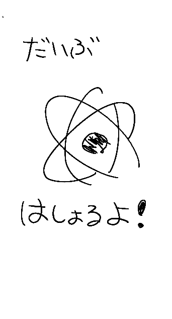

---

## React のレンダリング

- トリガーフェーズ
  - レンダリングを発動
- スケジューリングフェーズ
  - タスクをいいタイミングで実行
- レンダーフェーズ
  - 仮想 DOM を作成して差分検知
- コミットフェーズ
  - 実 DOM に書き込み

今回は下 2 つを解説します

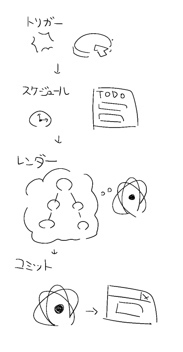

---

## Fiber ノード

いわゆる仮想 DOM と呼ばれる
根本のノードから二種類のツリーが生える

- FiberRootNode

  - React アプリケーションの
    Root ノード
    この FiberRootNode から
    二つのツリーが生える

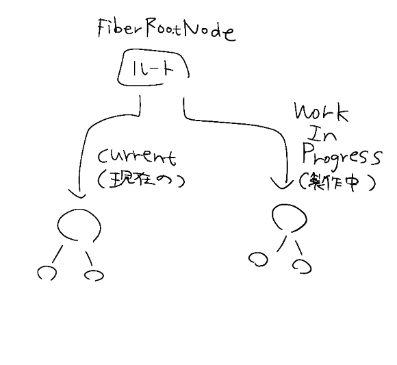

---

## Fiber ノード (続き)

- current
  - 現在のツリー
- workInProgress
  - 現在レンダリング中の
    新しいツリー

---

### なぜ 2 つ存在するの？

- ダブルバッファリングの考え方

  - 更新をパッと終わらせる
  - レンダリング中に
    UI が壊れることを防ぐ

- 旧版のツリーを保持することで

  - リソースの
    リサイクルができる
  - メモリ割り当ての
    コスト削減

  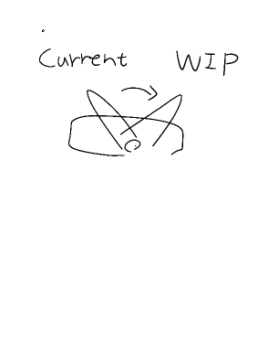

---

## レンダーフェーズ

### Fiber ノード詳細

今回解説する主要な Fiber ノードの種類は以下の 2 つ

- FunctionComponent
  - みなさんが普段書いている関数コンポーネント
- HostComponent
  - DOM ノード
  - web であれば`
` `` `
` といった HTML タグ

---

### Fiber ノードが持つ参照

- child: 子ノード
- sibling: 兄弟ノード
- return: 親ノード

これを利用することで
簡単にノードを巡回できる

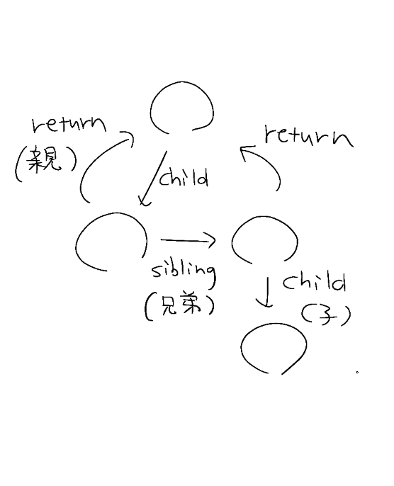

---

### Fiber ノードのプロパティ

- type/tag: ノードの種類
- flags: ノードのフラグ
  - 行うべき変更などが保持される
- stateNode: ノードの状態
  - 生成された DOM インスタンスなど
  - 関数コンポーネントの場合は
    実体がないため null
- その他…

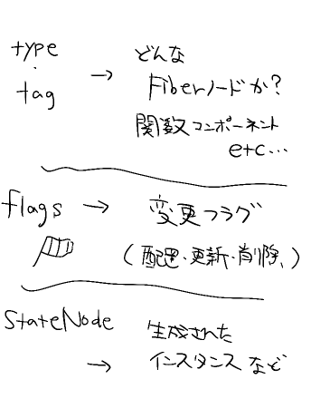

---

### レンダー開始

`performUnitOfWork` 関数から始まる
レンダーの最初は
コンポーネントの種類(tag)によって
動作が変わる

#### 関数コンポーネントの実行 A

レンダリングが必要なので実行する必要がある

フックを使いながら
関数コンポーネント実行
戻り値の ReactNode は後で利用

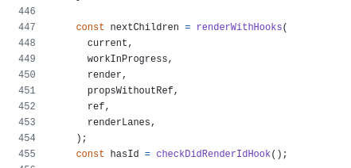

---

### 差分検出 B

`beginWork` 内部の`reconcile...`関連の関数で実行される

対象となる要素について差分検出(リコンサイル)を行う

- 同じタイプの要素は再利用
- key があれば key で一致をとり差分比較
- key がなければインデックスで一致をとり差分比較
  …など

---

### 差分検出 B (続き)

その結果に応じて flags にフラグを設定

- Placement:
  新しいノードを追加する
- Update:
  既存のノードを更新する
- Deletion:
  既存のノードを削除する

このフラグは二進数で作られており
合成することが可能

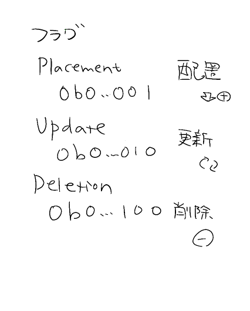

---

### 後処理 C

`completeWork` 内部で後処理を行う

- 先程のフラグを元に
  親ノードに 対してフラグを合成

  - 最終的に root ノードには
    すべてのフラグが合成される

更に HostComponent であれば

- DOM ノードを生成して stateNode に保持

- ※ 関数コンポーネントの場合は
  DOM ノードは生成されないことに注意

などを行う

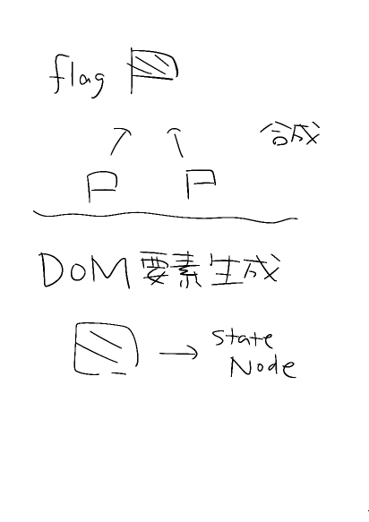

---

### 巡回のアルゴリズム

この処理の繰り返しが行われる
巡回の順番は以下の通り

1. まず対象ノードに対して A・B を実行
2. 子供がいるか調査

- 子供がいれば対象ノードを子供に変更して →1
- 子供いなければ 下へ

3. C を実行
4. 兄弟がいるか調査

- 兄弟がいれば対象ノードを兄弟に変更して →1
- 兄弟がいなければ 下へ

---

### 巡回のアルゴリズム (続き)

5. 親がいるか調査

- 親がいなければ
  レンダリングそのものの
  終了フラグを立て処理を終了
- 親がいれば下へ

6. 親ノードに戻り
   →3 で C 実行・兄弟調査
   繰り返す

A・B の処理と C の処理は
それぞれのノードでかならず
1 回ずつ行われる仕組み

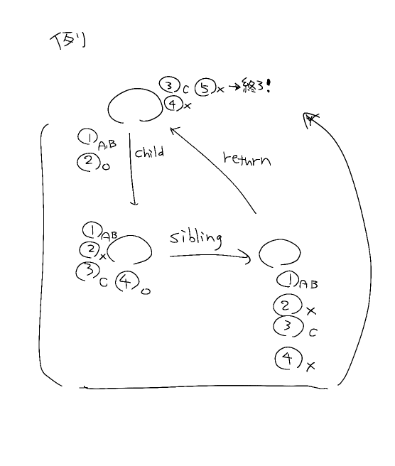

---

## コミットフェーズ

フラグや stateNode を元に実際の DOM ノードに変更を加える
(詳細は省略)

すべて適用処理が終わったとき
current と workInProgress の
二つのツリーを交換
作業中だったツリーが
current に昇格する

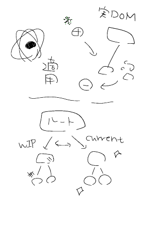

---

## コミットフェーズ (続き)

WIP はここで破棄せず
今後のレンダリングでリソースは
適宜再利用され有効活用される

- リソース作成の手間が省けてエコ

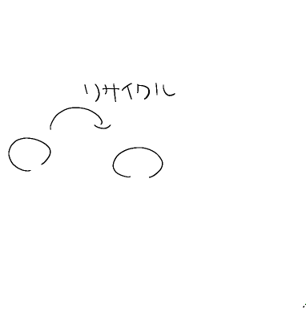

---

# まとめ

- Fiber の仕組み
- レンダーの流れ
  - 関数コンポーネント実行
  - 差分検出
  - 後処理
- 巡回のアルゴリズム
- コミットフェーズ

お疲れ様でした！

---

## 今回端折ったところ

- スケジューリングフェーズ全体
- 中断可能なレンダリング
- 初回レンダリングと更新レンダリングの違い
- ステートの実装
- フックの実装
- サイドエフェクトの動作

もし需要があれば Zenn にまとめるかも？
